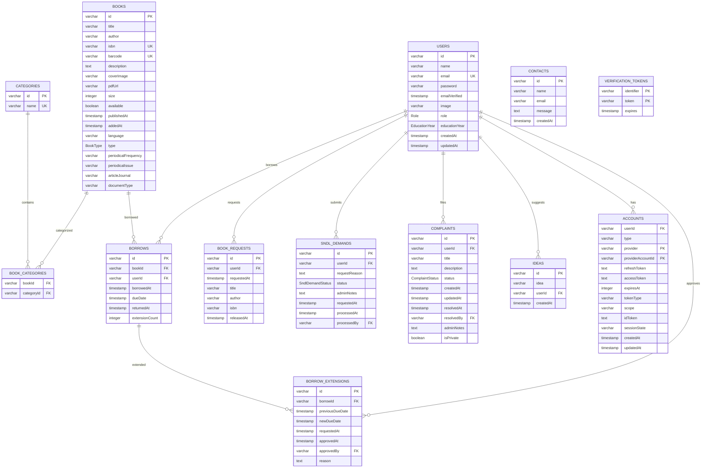
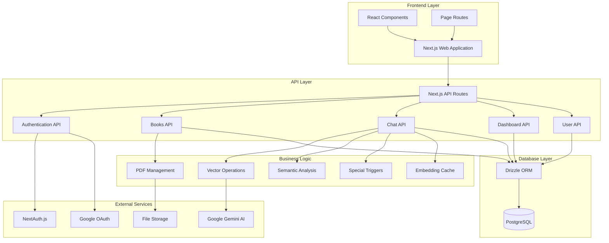
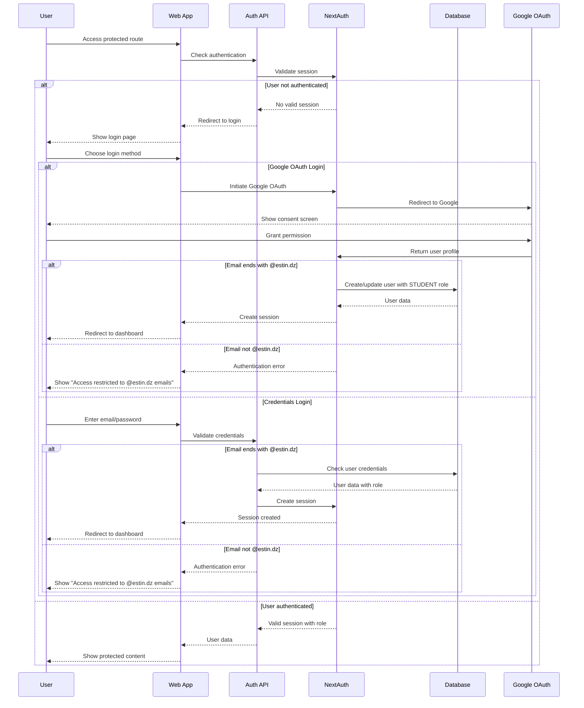
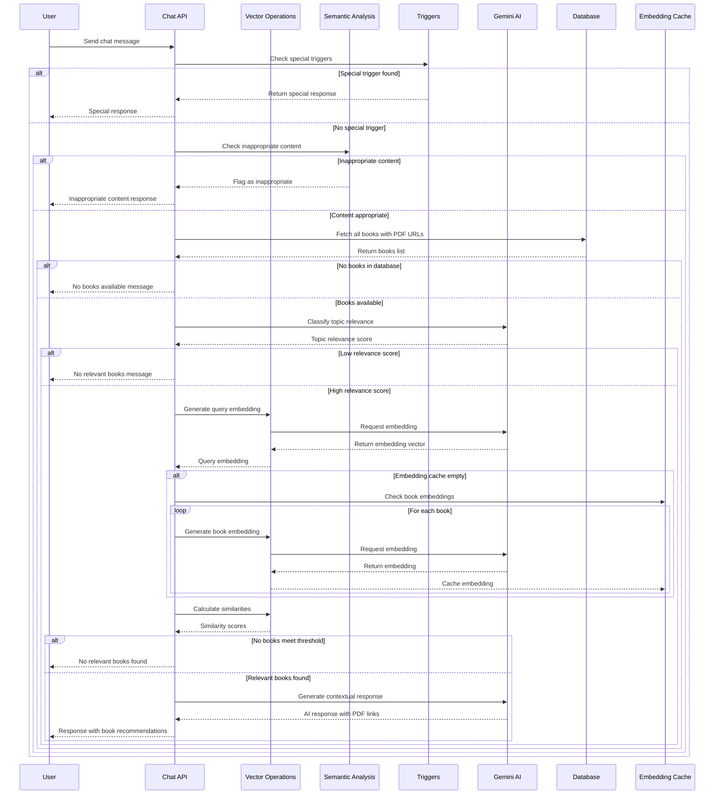
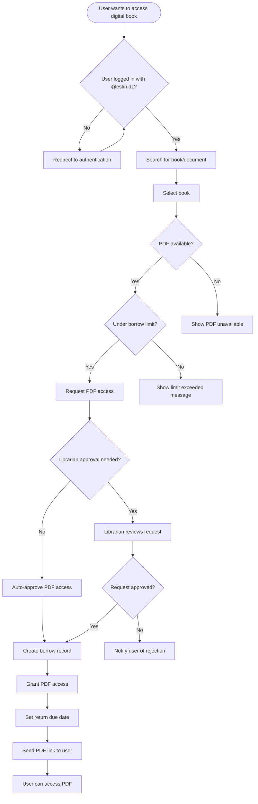
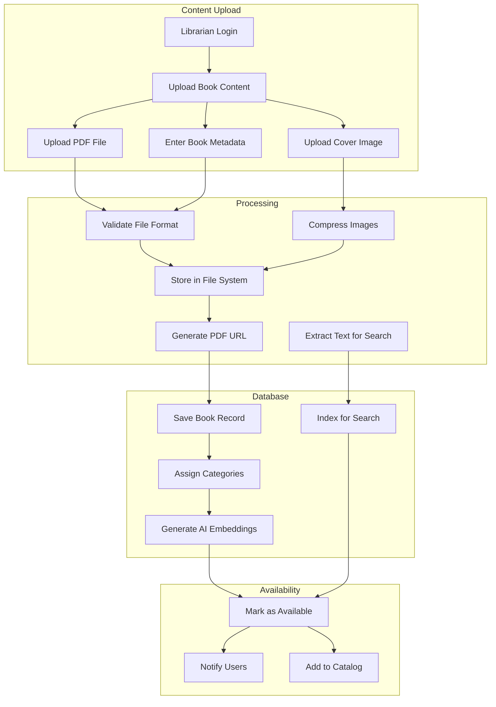
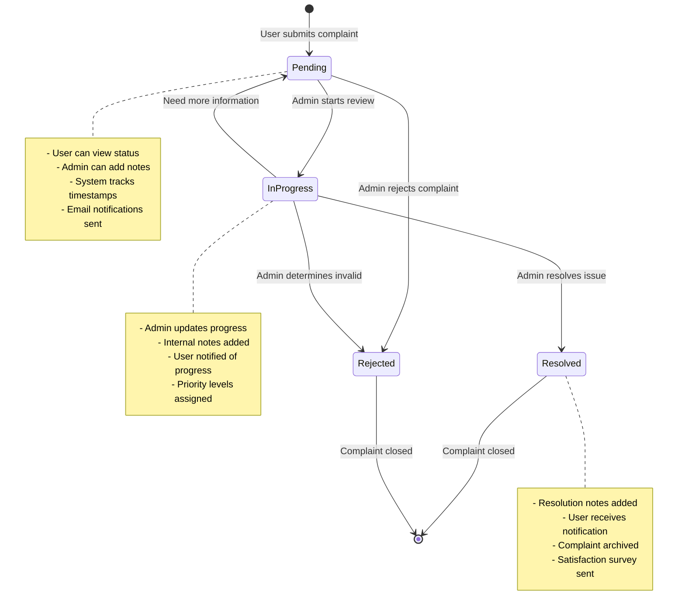
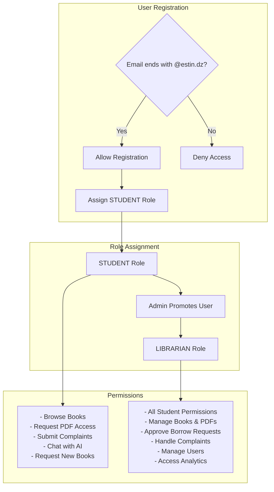
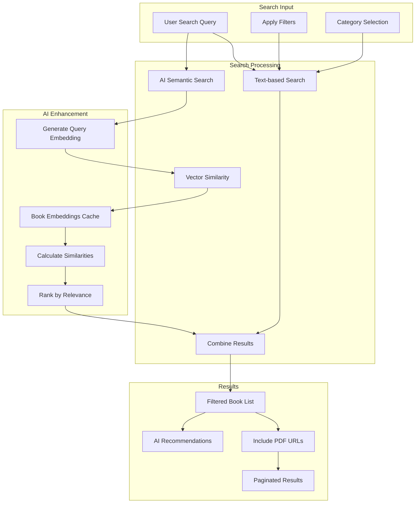
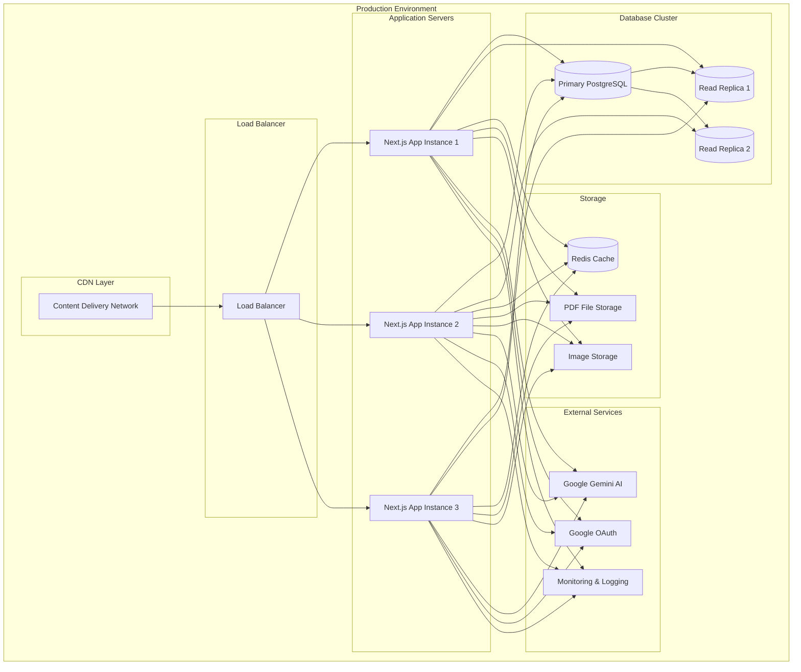

# EstinBib Digital Library System Diagrams

## Diagram 1 - Database Entity Relationship

## Diagram 2 - Web Application Architecture

## Diagram 3 - Authentication Flow with @estin.dz Restriction

## Diagram 4 - AI Chat System Flow

## Diagram 5 - Digital Book Borrowing Workflow

## Diagram 6 - Book Content Management System

## Diagram 7 - Complaint Management System

## Diagram 8 - User Role Management

## Diagram 9 - Search and Discovery System

## Diagram 10 - System Deployment Architecture

