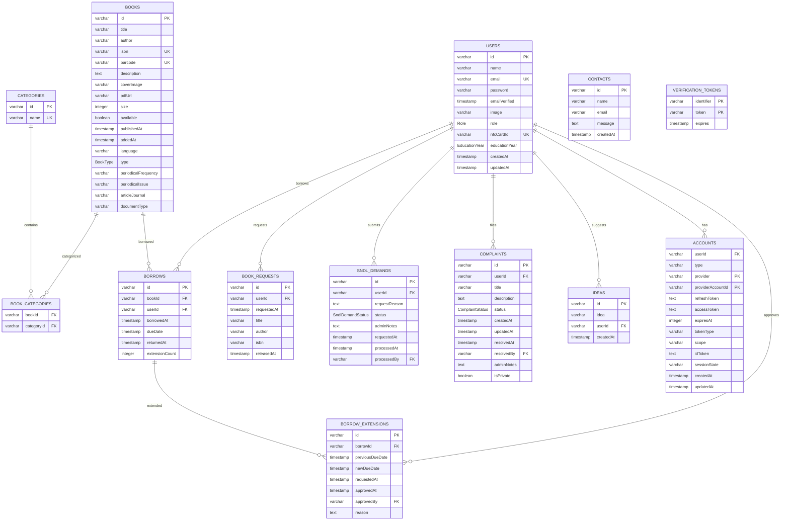
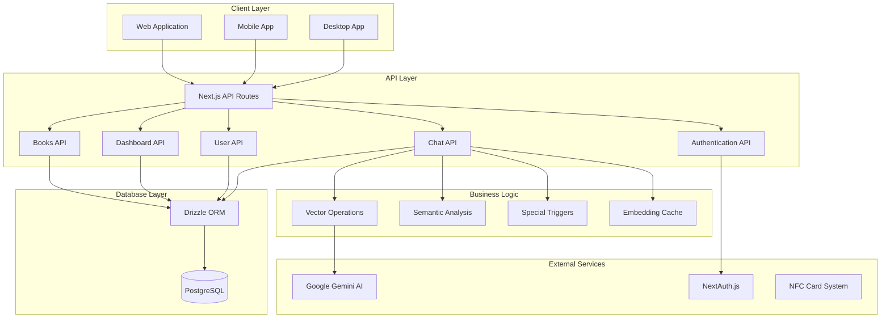
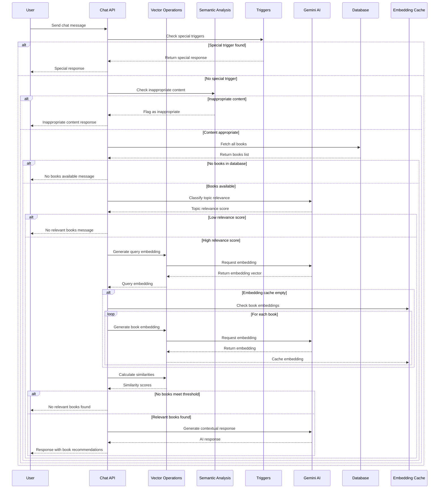
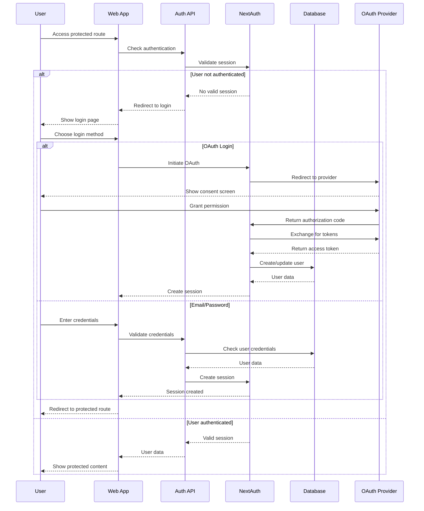
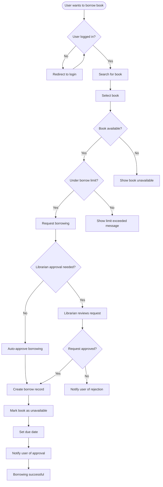
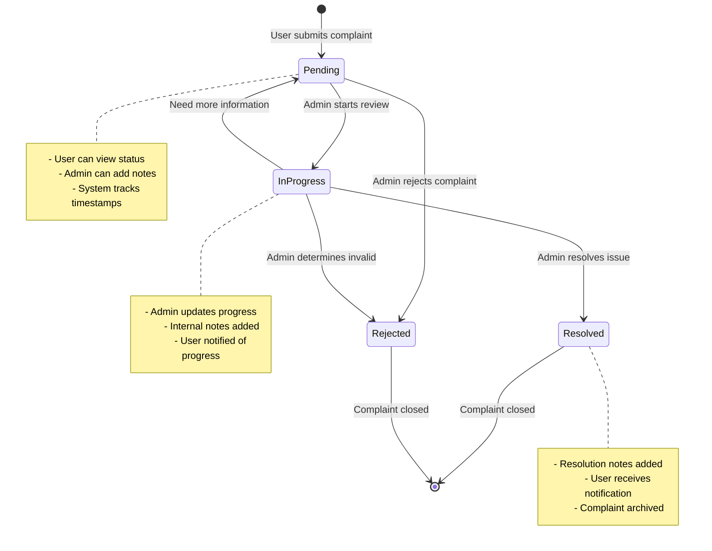
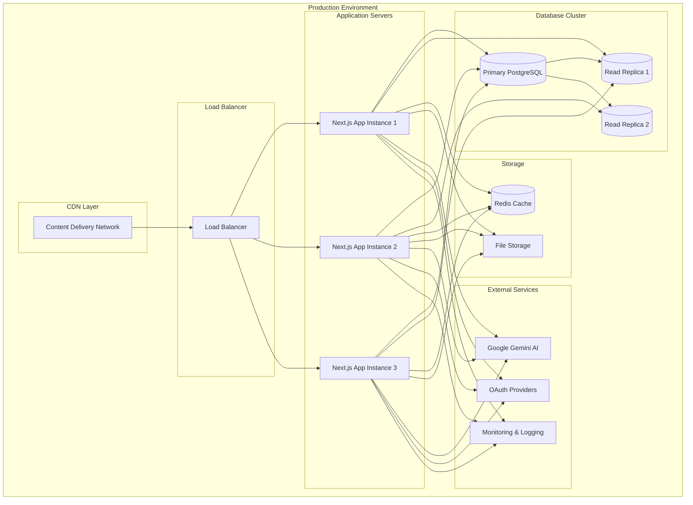
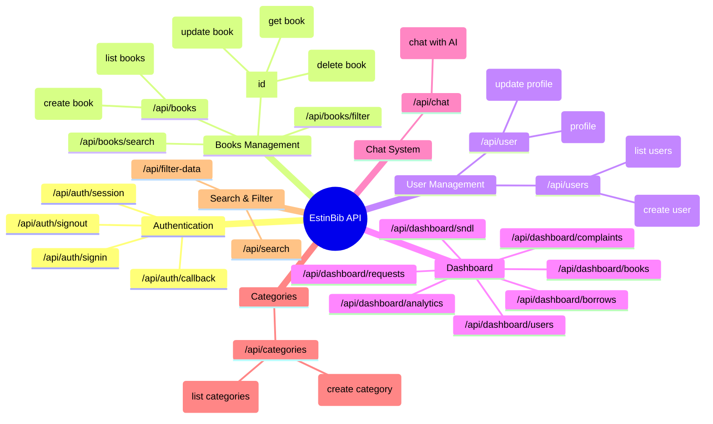

# EstinBib Library Management System

## System Documentation

This document contains comprehensive system diagrams for the EstinBib Library Management System, including database design, architecture, workflows, and deployment structures.

## 1. Database Entity Relationship Diagram



## 2. System Architecture Diagram



## 3. AI Chat Sequence Diagram



## 4. User Authentication Flow



## 5. Book Borrowing Workflow



## 6. Complaint Management System



## 7. Class Diagram - Core Entities

```mermaid
classDiagram
    class User {
        +String id
        +String name
        +String email
        +String password
        +Date emailVerified
        +String image
        +Role role
        +String nfcCardId
        +EducationYear educationYear
        +Date createdAt
        +Date updatedAt
        +borrowBook(bookId String)
        +returnBook(borrowId String)
        +requestExtension(borrowId String)
        +submitComplaint(complaint Complaint)
    }
    
    class Book {
        +String id
        +String title
        +String author
        +String isbn
        +String barcode
        +String description
        +String coverImage
        +String pdfUrl
        +Integer size
        +Boolean available
        +Date publishedAt
        +Date addedAt
        +String language
        +BookType type
        +String periodicalFrequency
        +String periodicalIssue
        +String articleJournal
        +String documentType
        +checkAvailability()
        +updateAvailability(status Boolean)
        +getEmbeddingText()
    }
    
    class Borrow {
        +String id
        +String bookId
        +String userId
        +Date borrowedAt
        +Date dueDate
        +Date returnedAt
        +Integer extensionCount
        +requestExtension(reason String)
        +markReturned()
        +isOverdue()
        +calculateFine()
    }
    
    class VectorOperations {
        -Map embeddingCache
        +getEmbedding(text String, genAI GoogleGenerativeAI)$ number[]
        +cosineSimilarity(vecA number[], vecB number[])$ number
        +getBookEmbeddingText(book BaseBook)$ String
    }
    
    class ChatAPI {
        +handleChatRequest(request ChatRequest)
        +processMessage(message String)
        +findRelevantBooks(query String)
        +generateResponse(context String)
    }
    
    class Complaint {
        +String id
        +String userId
        +String title
        +String description
        +ComplaintStatus status
        +Date createdAt
        +Date updatedAt
        +Date resolvedAt
        +String resolvedBy
        +String adminNotes
        +Boolean isPrivate
        +updateStatus(status ComplaintStatus)
        +addAdminNote(note String)
    }
    
    User ||--o{ Borrow
    User ||--o{ Complaint
    Book ||--o{ Borrow
    VectorOperations ..> Book
    ChatAPI ..> VectorOperations
    ChatAPI ..> Book
```

## 8. Deployment Architecture



## 9. API Endpoints Overview



## Key Features

### 🤖 AI-Powered Chat System
- Semantic search using Google Gemini AI
- Vector embeddings for book recommendations
- Intelligent content filtering and triggers

### 📚 Comprehensive Book Management
- Multiple book types (Books, Periodicals, Articles, Documents)
- Advanced search and filtering capabilities
- Barcode and ISBN tracking
- PDF support with file management

### 👥 User Management
- Multi-role system (Admin, Librarian, Student, Teacher)
- NFC card integration for easy access
- Education year tracking
- OAuth and email/password authentication

### 📊 Dashboard & Analytics
- Real-time system analytics
- Borrowing statistics and trends
- User activity monitoring
- Complaint and request tracking

### 🔄 Borrowing System
- Automated and manual approval workflows
- Extension request handling
- Due date management
- Fine calculation system

### 🎯 Additional Features
- SNDL (Service National de Documentation et de Liaison) integration
- Complaint management system
- Book request system
- Ideas and suggestions collection
- Contact form management

## Technology Stack

- **Frontend**: Next.js, React, TypeScript
- **Backend**: Next.js API Routes
- **Database**: PostgreSQL with Drizzle ORM
- **Authentication**: NextAuth.js
- **AI**: Google Gemini AI
- **Deployment**: Scalable cloud architecture with load balancing
- **Caching**: Redis for performance optimization

## Getting Started

1. Clone the repository
2. Install dependencies: `npm install`
3. Set up environment variables
4. Run database migrations
5. Start the development server: `npm run dev`

## Contributing

Please read our contributing guidelines and code of conduct before submitting pull requests.

## License

This project is licensed under the MIT License - see the LICENSE file for details.
